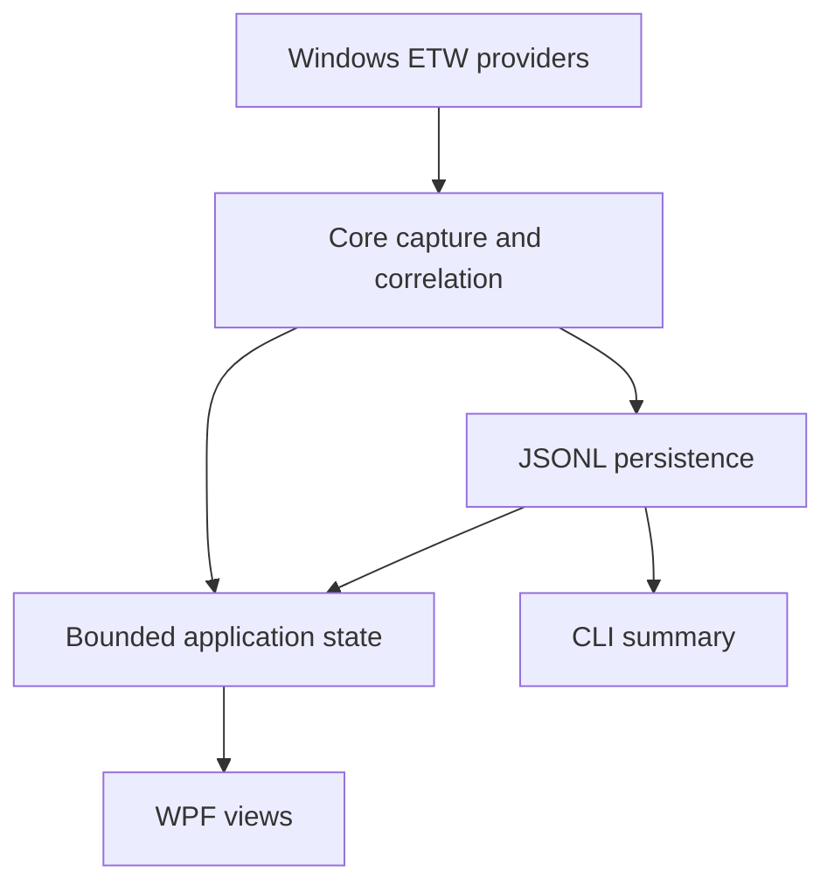

# Architecture

Windows Telemetry Inspector uses a shared-engine architecture so the GUI and the existing command-line interface observe and interpret events consistently.

## Projects

### `NetworkTransparency.Core`

The platform-facing engine owns:

- ETW session lifetime and explicit capture state.
- IPv4 and IPv6 TCP/UDP event ingestion.
- A bounded channel that keeps ETW callbacks short and moves metadata work off the provider thread.
- Cumulative per-flow byte tracking.
- PID/process metadata with time-bounded caches.
- PID-to-service lookup and service state.
- DNS query/response observation and time-bounded IP-to-name correlation.
- Nearby Task Scheduler correlation with a visible time distance.
- Restrained category/confidence classification.
- Backward-compatible JSONL reading/writing, filtering, deltas, and summary aggregation.

Platform-specific resolvers return explicit unknown states when unavailable. They do not fabricate metadata.

### `WindowsTelemetryInspector`

The WPF application owns:

- Capture and recording orchestration.
- A bounded pending-event queue and configurable retained-event limit.
- Dispatcher-timer batching instead of one UI dispatch per ETW event.
- Virtualized data grids and collection views.
- Navigation, search/filter state, event selection, aggregates, settings, and dialogs.
- Explicit non-admin, partial-provider, write-error, malformed-file, and unexpected-stop messages.

Views bind to view models; they do not start ETW sessions or parse capture files directly.

### `NetworkTransparency`

The CLI retains the public `live`, `record`, and `summary` workflows. It references the same core project as the GUI, avoiding a second implementation of capture or classification.

### `NetworkTransparency.Tests`

Tests focus on deterministic engine behavior: classification precedence, DNS matching, filtering, cumulative-flow delta aggregation, old/new JSONL parsing, bounded import, and serialization round trips. UI behavior is kept out of brittle pixel tests.

## Event pipeline

ETW callbacks normalize raw provider data into small internal events and enqueue them. A single aggregation worker updates flow counters, resolves cached metadata, correlates DNS/tasks, classifies the event, and writes to sinks. The GUI sink enqueues enriched events for batched dispatcher updates; an optional recording sink appends JSONL independently of UI retention.

This separation means lowering the in-memory UI limit does not truncate an active recording.

## Correlation semantics

DNS names and scheduled tasks are contextual evidence:

- `CorrelatedResponse` means a recent DNS response mapped an address to a name.
- `Cached` means an older, retained DNS mapping was used.
- `NotResolved` and `Unavailable` remain visible states.
- Task matches are labeled as correlated/nearby executions and include their time distance.

None of these states proves that a DNS query or task caused a network flow.

## Persistence

JSONL remains schema-compatible with the original CLI. Richer metadata is appended as optional properties. Missing extension fields deserialize to conservative defaults. Malformed input lines are counted and skipped so useful portions of a diagnostic capture remain inspectable.
